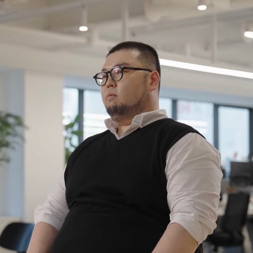

    

|번호|발표 유형|이름|소속|제목|발표 소개|
|:---:|:-----------------:|:-----------:|:--------:|:--------:|:--------:|
|1|스피커(Speaker)|이종원|Samsung Electronics|우린 머신과 어떻게 다르게 이야기하나(How do we talk to machines differently?|[발표자료(Presentations)](data/jongwon.pdf)/[발표영상(Presentation Video)](https://youtu.be/HXIvbnA0SnU)|    
|2|스피커(Speaker)|박장원|BHSN|특정 도메인에 맞는 언어모델은 어떻게 만들까?(How do I create a language model for a specific domain?)|[발표자료(Presentations)](data/specific_domain.pdf)/[발표영상(Presentation Video)](https://youtu.be/N3VDk9pRZuw)|     
|3|스피커(Speaker)|고석현|Toss|Shallow한 자연어 검색 만들기(Create a shallow natural language search)|[발표자료(Presentations)](data/go_v3.pdf)/[발표영상(Presentation Video)](https://youtu.be/BLO-P5o8mkg)|     
|4|스피커(Speaker)|고현웅|Tunib|EleutherAI에서의 1년(One year at EleutherAI)|[발표자료(Presentations)](data/kevinko.pdf)/[발표영상(Presentation Video)](https://youtu.be/yeAY_7cQj5k)|       
|5|스피커(Speaker)|이주홍|Scatterlab|인공지능과 친구가 될 수 있을까요?(Can we be friends with AI?)|[발표자료(Presentations)](data/scatterlab_v2.pdf)/[발표영상(Presentation Video)](https://youtu.be/QAzpAImIrMI)|   
|6|스피커(Speaker)|신정규|Lablup|Building large language models at scale|[발표자료(Presentations)](data/JKShin-LLM-v2.pdf)/[발표영상(Presentation Video)](https://youtu.be/7uKjECYfYJU)|            

    
# Staff

|:--------:|:-----------------:|:-----------:|:--------:|
|송영숙|송치성|조원익|박신홍|송진영|    
|박해선|김택현|송명근|민경국|박혜웅|                          

