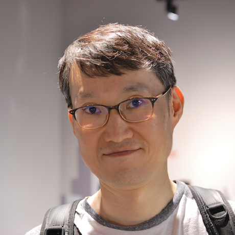

    

|번호|발표 유형|이름|소속|제목|발표 소개|
|:---:|:-----------------:|:-----------:|:--------:|:--------:|:--------:|
|1|스피커|이종원|삼성전자|우린 머신과 어떻게 다르게 이야기하나|[발표자료](data/HumanvsAI.pdf)|    
|2|스피커|박장원|BHSN|특정 도메인에 맞는 언어모델은 어떻게 만들까?|-|     
|3|스피커|고석현|토스|Shallow한 자연어 검색 만들기|-|     
|4|스피커|고현웅|튜닙|EleutherAI에서의 1년|-|       
|5|스피커|이주홍|스캐터랩|인공지능과 친구가 될 수 있을까요?|[발표자료](data/scatterlab.pdf)|   
|6|스피커|신정규|Lablup|Building large language models at scale|[발표자료](20230218_Scale.pdf)|            

    
# 행사 진행

|:--------:|:-----------------:|:-----------:|:--------:|
|송영숙|송치성|조원익|박신홍|송진영|    
|박해선|김택현|송명근|민경국|박혜웅|                          

