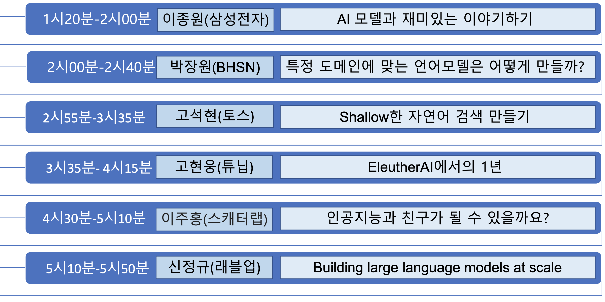
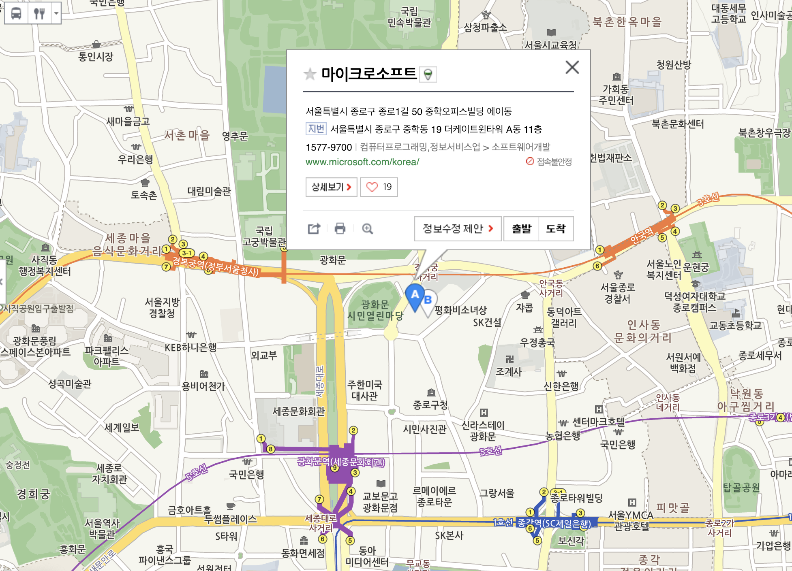

---
# Feel free to add content and custom Front Matter to this file.
# To modify the layout, see https://jekyllrb.com/docs/themes/#overriding-theme-defaults

layout: home
---

                            
                          
                            

# 찾아 오시는 길           
[서울특별시 종로구 중학동 19 더케이트윈타워 A동](http://naver.me/IMlGLw7y) 마이크로소프트 광화문 사옥 13층, Conference 룸                                      

# 지난 대회 보기              
[Langcon2021](https://songys.github.io/2021Langcon/)      
 >[발표 동영상](https://www.youtube.com/playlist?list=PLqkITFr6P-oTd4YenELiGHcKSBdgVaC0L)     

[Langcon2020](https://songys.github.io/2020LangconOnOff/)         
 >[발표 동영상](ttps://www.youtube.com/playlist?list=PLqkITFr6P-oRTpBB7GZB7zRq70RQ4Brqt)  

[Langcon2019](https://songys.github.io/2019LangCon/)      
         
[멜팅팡_연합세미나](https://www.onoffmix.com/event/110570)  

[사람이 챗봇을 만듭니다!](https://www.onoffmix.com/event/124842)             
 >[발표 동영상](https://www.youtube.com/playlist?list=PLqkITFr6P-oRQu0OJCIqHuff-ubbCkWlL)                       
       
[봇봇봇](https://www.onoffmix.com/event/89407)           

    

# 후원                       
          

