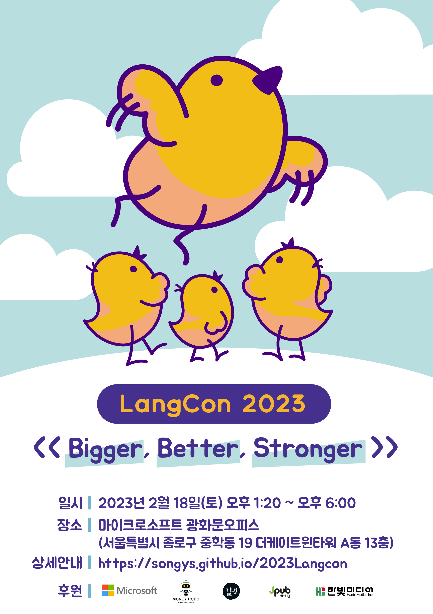

---
# Feel free to add content and custom Front Matter to this file.
# To modify the layout, see https://jekyllrb.com/docs/themes/#overriding-theme-defaults

layout: home
---

                            
                           
 2023Langcon  초거대 AI 모델과 재미있는 이야기하기 : Bigger, Better, Stronger     
(2023Langcon Talking Fun with Large languahe Models: Bigger, Better, Stronger)     
           
           
시간 : 2023년 2월 18일(토)        
참여 방식 : 오프라인        
행사 목적 : 최근 거대 모델을 대상으로 한 자연어처리 동향 이해      
                 생성 모델링  및 서비스의 이해                   
Time : Saturday, February 18, 2023        
Participation Method : Offline        
Event Purpose : Understand recent trends in natural language processing, generative modeling, and services targeting giant models    

          
   
                         

각 발표는 개인 발표이고 회사의 방향성을 대표하는 것이 아님을 알려드립니다.
Please note that each presentation is personal and does not represent the direction of the company.

# 찾아 오시는 길(How to find us)           
[서울특별시 종로구 중학동 19 더케이트윈타워 A동](http://naver.me/IMlGLw7y) 마이크로소프트 광화문 사옥 13층, Conference 룸                                      
    

# 지난 대회 보기(past conferences)              
[Langcon2021](https://songys.github.io/2021Langcon/)      
 >[Videos](https://www.youtube.com/playlist?list=PLqkITFr6P-oTd4YenELiGHcKSBdgVaC0L)     

[Langcon2020](https://songys.github.io/2020LangconOnOff/)         
 >[Videos](https://www.youtube.com/playlist?list=PLqkITFr6P-oRTpBB7GZB7zRq70RQ4Brqt)  

[Langcon2019](https://songys.github.io/2019LangCon/)      
 >[Videos(khaiii(카카오 형태소 분석기)](https://youtu.be/NV5rjDRCebk)
         
[멜팅팡_연합세미나](https://www.onoffmix.com/event/110570)  

[사람이 챗봇을 만듭니다!](https://www.onoffmix.com/event/124842)             
 >[발표 동영상](https://www.youtube.com/playlist?list=PLqkITFr6P-oRQu0OJCIqHuff-ubbCkWlL)                       
       
[봇봇봇](https://www.onoffmix.com/event/89407)           

    

# 후원                       
 

 
 

      

## 발간 예정 도서 안내
 

         
            
         
  
         

